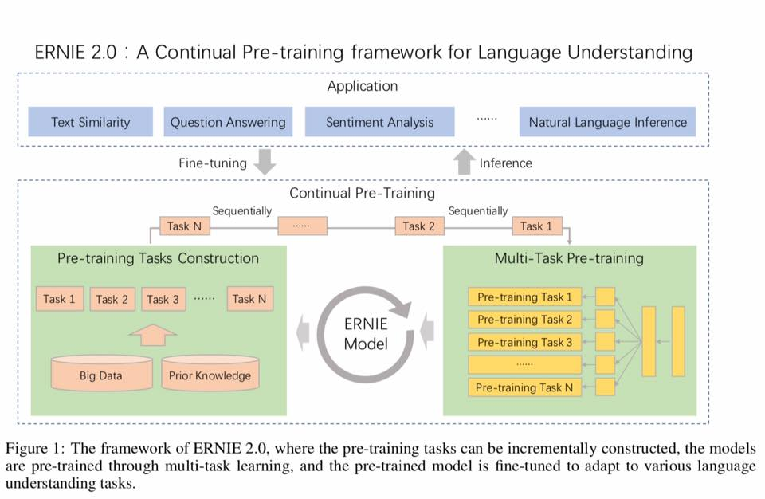
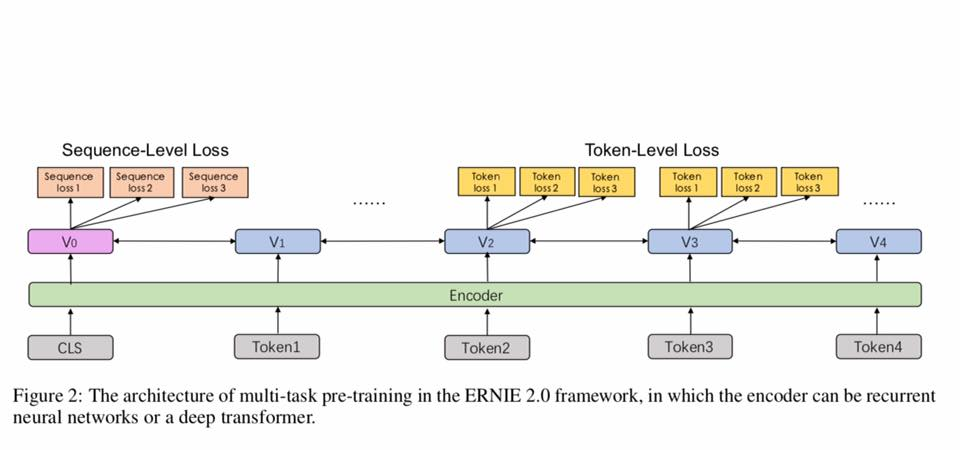
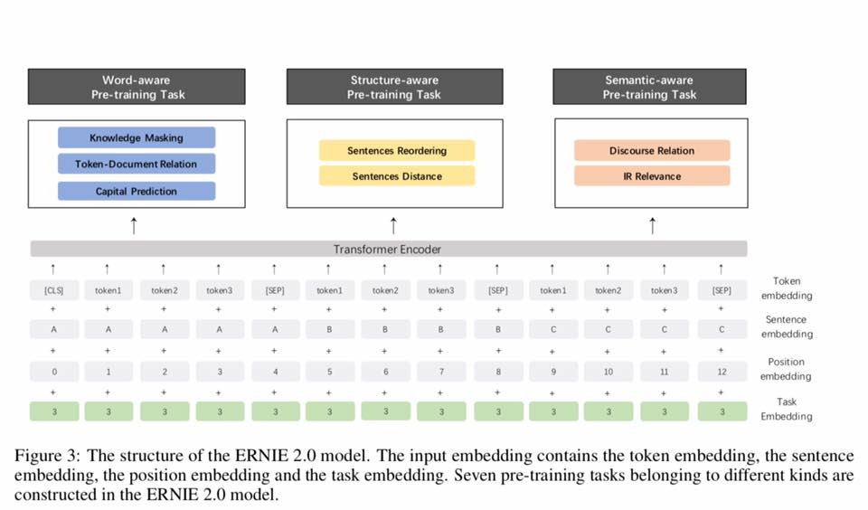
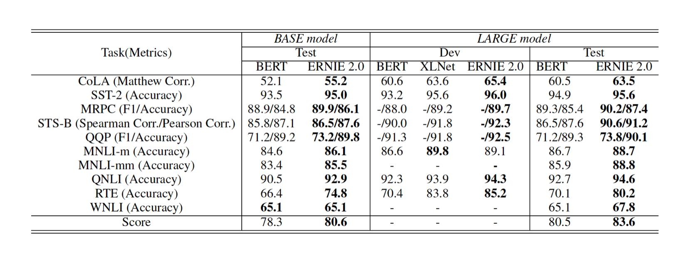

# ERNIE-2.0-from-Baidu-Inc.

Welcome ERNIE 2.0 from Baidu, Inc., a continual pre-training framework for language understanding, which achieves state-of-the-art results better than Google’s BERT and XLNet in a range of language understanding benchmarks.

LikeGoogle’s BERT, it relies on a transformer encoder and the BookCorpus data set for training.

Read at https://arxiv.org/pdf/1907.12412.pdf
